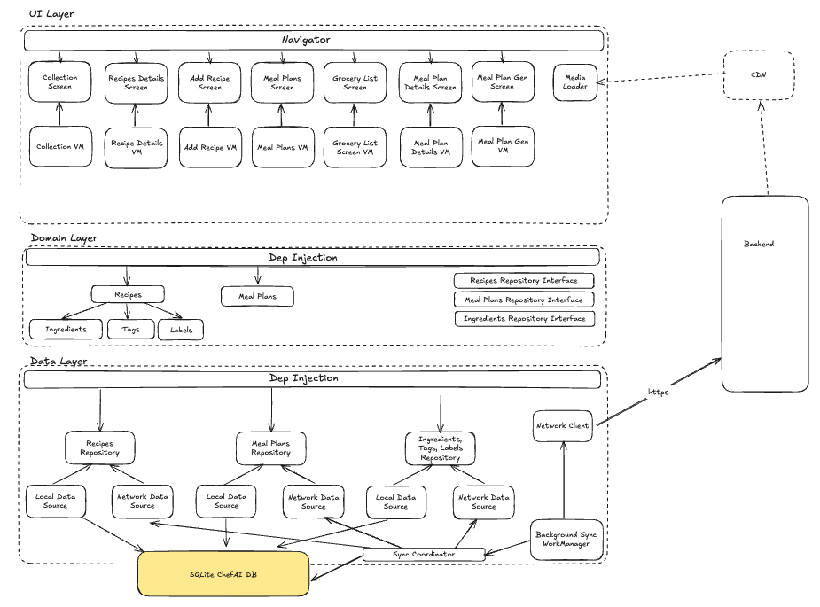

# Chef AI

ChefAI is a Kotlin-first Android app that allows users to manage their own recipe collection. It also provides a library of recipes for users to browse and save. The app can generate weekly meal plans based on user preferences like low-carb, vegan, or Mediterranean diets, and allows for customization of the meal plan. Additionally, ChefAI can export the list of ingredients needed for a meal plan to a grocery store for purchase or provide a simple grocery list.

## Installation

Open with Android Studio.

## Usage

This project is still under development.

# Documentation

See the [docs folder](docs/)

## Overall architecture

🏗️ Architecture Overview

ChefAI follows a Clean Architecture with an offline-first design.

UI Layer – Jetpack Compose screens with ViewModels that interact only with domain use cases.

Domain Layer – Pure Kotlin business logic, entity models, and repository interfaces.

Data Layer – Dual-source repositories combining Room (SQLite) for local caching and a Ktor network client for backend access.

Sync – Background WorkManager handles two-step sync (push local outbox → pull backend deltas).

IDs & Storage – All entities use client-generated, time-sortable UUIDv7 IDs; Room provides full-text search and ACID transactions.

Dependency Injection – Hilt/Koin modules wire DAOs, network clients, and repositories.

This structure keeps UI reactive, data consistent across devices, and the codebase modular, testable, and ready to scale.
## Chosen Libraries

Dependency Injection:
* [Hilt](https://developer.android.com/training/dependency-injection/hilt-android)

Data Base Layers:
* [Room](https://developer.android.com/training/data-storage/room)

Android UI:
* [Jetpack Compose](https://developer.android.com/jetpack/compose)
* [Navigation Compose](https://developer.android.com/jetpack/compose/navigation)
* [Material 3](https://m3.material.io/)
* [Lifecycle/ViewModel](https://developer.android.com/topic/libraries/architecture/lifecycle)

Image Loading:
* [Coil](https://github.com/coil-kt/coil)

Networking: 
* [Ktor](https://ktor.io/docs/welcome.html) with CIO engine, content negotiation, and logging
* [Kotlinx Serialization](https://github.com/Kotlin/kotlinx.serialization)

Coroutines:
* [Kotlinx Coroutines](https://github.com/Kotlin/kotlinx.coroutines)

Utils:
* [Timber](https://github.com/JakeWharton/timber)
* [SLF4J](http://www.slf4j.org/) and [Logback](https://logback.qos.ch/) for Ktor logging

## Backend Test End Points

You can use the enpoints hosted in this repo to test the backend:
https://github.com/jmuci/ChATestAPI/tree/main?tab=readme-ov-file

## Contributing

Pull requests are welcome. For major changes, please open an issue first
to discuss what you would like to change.

Please make sure to update tests as appropriate.
