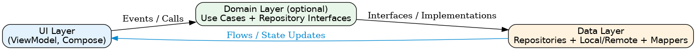
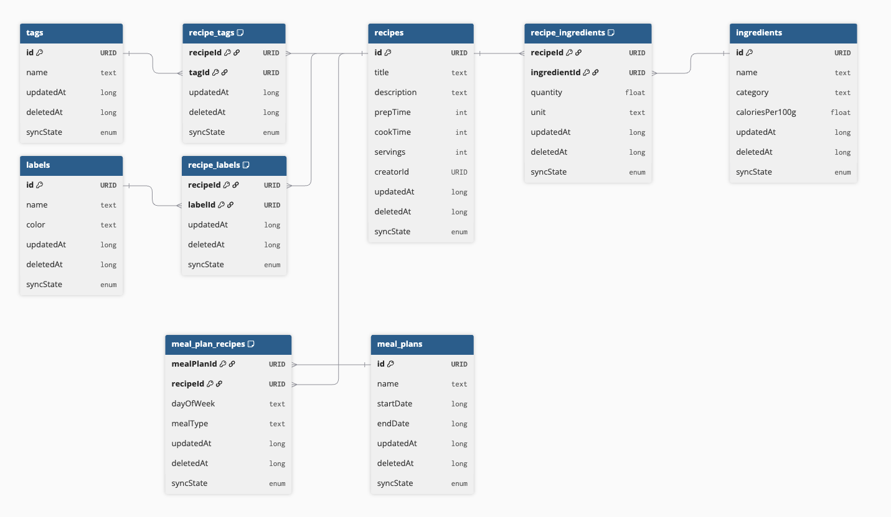

# ChefAI Architecture Overview

_Last updated: February 2026_

ChefAI follows a **Hybrid Architecture** based on Google’s Modern Android Architecture, selectively enhanced with **Clean Architecture principles**.  
The goal is to balance **developer velocity** (for a solo engineer) with **clarity, testability, and scalability** for future growth or collaboration.

---

## 🧩 Layer Overview

```
                UI (Compose, ViewModels)
                            ↓
Domain (Use Cases, Domain Entities, Repository Interfaces)
                            ↓
 Data (Repository Implementations, Local/Remote, Mappers)
```




### UI Layer
- Uses Jetpack Compose and `ViewModel` with `StateFlow` for state management.
- Emits **UI events** upward and receives **state updates** downward.
- Contains no data logic or persistence dependencies.

### Domain Layer
- Optional layer used when logic grows in complexity or reuse.
- Holds:
    - **Domain models (entities)** — pure Kotlin, representing business meaning.
    - **Use Cases** — reusable, testable orchestration of repositories or domain logic.
    - **Repository interfaces** — abstractions implemented in the Data layer.
- Free of Android or I/O dependencies.

### Data Layer
- Contains repository implementations, data sources (Room, Ktor), DTOs, and mappers.
- Owns the **single source of truth** for persisted or cached data.
- Responsible for coordinating between network, local storage, and mapping to/from domain.

### BE Sync Mechanism 


```
┌──────────────────────────────────────────────────┐
│                    UI Layer                       │
│  Compose Screens ← ViewModel ← StateFlow/Paging  │
└──────────────────────┬───────────────────────────┘
                       │ observes
┌──────────────────────▼───────────────────────────┐
│                 Domain Layer                      │
│  Repository interfaces, Use Cases, Domain Models  │
└──────────────────────┬───────────────────────────┘
                       │ implements
┌──────────────────────▼───────────────────────────┐
│                  Data Layer                       │
│                                                   │
│  ┌─────────────┐    ┌──────────────┐             │
│  │  Room (SSOT) │    │ Ktor Client  │             │
│  │  11 entities │    │ Auth + Sync  │             │
│  │  sync_meta   │    │ endpoints    │             │
│  └──────┬──────┘    └──────┬───────┘             │
│         │                   │                     │
│         └───────┬───────────┘                     │
│                 │                                 │
│         ┌───────▼────────┐                        │
│         │  SyncWorker    │                        │
│         │  (WorkManager) │                        │
│         │  Push → Pull   │                        │
│         └────────────────┘                        │
│                                                   │
│  SessionManager (Anonymous | Authenticated)       │
└───────────────────────────────────────────────────┘
```




### Current Implementation Status (Feb 2026)

| Component | Status | Notes |
|-----------|--------|-------|
| Room database (11 entities) | Done | Version 2, migration support |
| DAOs with CRUD + pagination | Done | `RecipeDao` includes paginated query |
| Repositories (Recipe, Metadata) | Done | Local-only, hardcoded test user |
| Ktor HTTP client + auth interceptor | Done | CIO engine, JSON, logging |
| Auth (SessionManager, SecurePrefs) | Done | Login/register/refresh against backend API |
| Paging 3 integration | Done | PagingSource → Repository → ViewModel → UI |
| SyncableEntity interface | Done | All entities have syncState, updatedAt, deletedAt |
| Anonymous-first usage | Not started | App requires login; no anonymous session yet |
| Sync (push/pull, WorkManager) | Not started | No Outbox, no SyncWorker, no sync_metadata table |
| Offline conflict resolution | Not started | SyncState.CONFLICT defined but unused |
| HomeScreen repository integration | Not started | Uses static placeholder data |
| Meal Plans | Stub only | Empty screen + ViewModel |

---

## 🔄 Unidirectional Data Flow (UDF)

```
UI → Domain → Data
↑               ↓
--< State Flow <--
```

- **Events flowdown from UI → Domain → Data** user actions, triggers, or intents.
- **State flows up from Data → Domain → UI** data updates or UI models emitted via `Flow`/`StateFlow`.
- Each data type has a **single source of truth** (usually a repository).

---

## 🧱 Entities and Models

| Layer | Type | Example | Notes |
|-------|------|----------|-------|
| Domain | Entity / Business Model | `Recipe` | Core business truth |
| Network | DTO | `RecipeResponse` | Mirrors API schema |
| Database | Persistence Model | `RecipeEntity` | Matches Room table |
| UI | UI Model | `RecipeUi` | Tailored for presentation |

Mappers convert between these layers under `data/mapper/` and `ui/mappers/`.

---

## ⚙️ Dependency Direction

`UI → Domain → Data`

- Domain defines interfaces; Data implements them.
- No Android or storage dependencies are allowed in the Domain layer.
- ViewModels and UseCases are constructed via dependency injection (Hilt).

---

## ✅ Design Principles

- **Simplicity First:** introduce layers only when needed.
- **Testability:** all business logic must be unit-testable without Android.
- **Separation of Concerns:** UI, business rules, and data persistence stay isolated.
- **Explicit Data Flow:** no mutable shared state across layers.
- **Evolution-friendly:** easily migrate to multi-module (e.g. `:domain`, `:data`) if app grows.

---

## 📄 Related Documents

- [`/AGENTS.md`](../AGENTS.md) — formal rules for AI/code generation.
- [`/docs/adrs/adr-001-hybrid-architecture-choice.md`](adrs/adr-001-hybrid-architecture-choice.md) — rationale for choosing this hybrid architecture.
- [`/docs/adrs/adr-002–local-DB-choice-and-ID-gen.md`](adrs/adr-002–local-DB-choice-and-ID-gen.md) — SQLite/Room + UUIDv7.
- [`/docs/adrs/adr-003–two-step-BE-sync.md`](adrs/adr-003–two-step-BE-sync.md) — Two-step sync model.
- [`/docs/adrs/adr-004-data-layer.md`](adrs/adr-004-data-layer.md) — Data layer composition.
- [`/docs/adrs/adr-0005-feature-based-package-structure.md`](adrs/adr-0005-feature-based-package-structure.md) — Feature-based packaging.
- [`/docs/authentication.md`](authentication.md) — Auth system documentation.