# ChefAI Architecture Diagram (Updated 2025)

This document contains the updated architecture diagram in Mermaid format.
You can render this using:

- GitHub's native Mermaid support
- Mermaid Live Editor (https://mermaid.live)
- VS Code with Mermaid preview extension
- Convert to PNG using mermaid-cli

## Architecture Diagram

```mermaid
graph TB
    subgraph "UI Layer - Jetpack Compose"
        A1[Home Screen]
        A2[Recipes Screen<br/>RecipeDetails<br/>CreateRecipe]
        A3[Meal Plans Screen<br/>Details<br/>Generate]
        A4[User Profile Menu]
        A5[Navigation<br/>TopAppBar<br/>BottomNav<br/>FAB Menu]
        
        A1 --> VM1[Home ViewModel]
        A2 --> VM2[Recipes ViewModel]
        A3 --> VM3[Meal Plans ViewModel]
        A4 --> SM[SessionManager]
    end
    
    subgraph "Domain Layer - Business Logic"
        SM[SessionManager<br/>Auth State Management]
        
        UC1[Recipe Use Cases]
        UC2[Meal Plan Use Cases]
        
        DM1[Domain Models<br/>Recipe, Ingredient<br/>Tag, Label, User]
        
        RI1[RecipesRepository<br/>Interface]
        RI2[MealPlansRepository<br/>Interface]
        RI3[IngredientsRepository<br/>Interface]
    end
    
    subgraph "Data Layer - Repositories & Data Sources"
        R1[DefaultRecipeRepository]
        R2[MealPlansRepository Impl]
        R3[IngredientsRepository Impl]
        
        subgraph "Local Data Sources"
            SP[SecurePreferences<br/>EncryptedDataStore<br/>Auth Tokens]
            
            DB[(Room Database<br/>SQLite ChefAI DB)]
            
            DAO1[RecipeDao]
            DAO2[IngredientDao]
            DAO3[TagDao]
            DAO4[LabelDao]
            DAO5[UserDao]
            DAO6[AllergenDao]
            DAO7[SourceClassificationDao]
            DAO8[MealPlanDao]
            
            ENT[Entities<br/>RecipeEntity<br/>IngredientEntity<br/>UserEntity<br/>etc.]
        end
        
        subgraph "Network Data Sources"
            API[ChefAI API Service<br/>Ktor Client]
            AI[AuthInterceptor<br/>Auto-add tokens]
            
            DTO[Network DTOs<br/>RecipeResponse<br/>etc.]
        end
        
        subgraph "Mappers"
            M1[RoomDomainMap]
            M2[NetworkDomainMap]
        end
    end
    
    subgraph "Infrastructure & Cross-Cutting"
        IL[Image Loader<br/>Coil + OkHttp<br/>Auth + Caching]
        LOG[Logging<br/>Timber<br/>SLF4J/Logback]
        DI[Dependency Injection<br/>Hilt Modules<br/>Network, Data, Auth]
        CO[Coroutines<br/>ApplicationScope<br/>IOScope]
    end
    
    subgraph "Backend Server"
        BE[Backend API<br/>REST Endpoints]
        SYNC[Sync Endpoints<br/>POST /sync/push<br/>GET /sync/pull]
    end
    
    %% UI to Domain connections
    VM1 --> UC1
    VM2 --> UC1
    VM3 --> UC2
    
    SM --> SP
    SM --> RI1
    
    %% Domain to Data connections
    UC1 --> RI1
    UC2 --> RI2
    
    RI1 -.implements.-> R1
    RI2 -.implements.-> R2
    RI3 -.implements.-> R3
    
    %% Repository connections
    R1 --> DAO1
    R1 --> API
    R1 --> M1
    R1 --> M2
    
    R2 --> DAO8
    R2 --> API
    
    R3 --> DAO2
    R3 --> API
    
    %% Database connections
    DB --> DAO1
    DB --> DAO2
    DB --> DAO3
    DB --> DAO4
    DB --> DAO5
    DB --> DAO6
    DB --> DAO7
    DB --> DAO8
    
    DAO1 --> ENT
    DAO2 --> ENT
    DAO3 --> ENT
    DAO4 --> ENT
    DAO5 --> ENT
    DAO6 --> ENT
    DAO7 --> ENT
    DAO8 --> ENT
    
    %% Network connections
    API --> AI
    AI --> SM
    API --> DTO
    API --> BE
    
    %% Sync connections
    API --> SYNC
    SYNC --> BE
    
    %% Infrastructure connections
    IL --> API
    DI --> SM
    DI --> R1
    DI --> R2
    DI --> R3
    DI --> API
    DI --> DB
    DI --> CO
    
    LOG --> VM1
    LOG --> VM2
    LOG --> VM3
    LOG --> SM
    LOG --> R1
    LOG --> API
    
    %% Styling
    classDef uiLayer fill:#e1f5ff,stroke:#01579b,stroke-width:2px
    classDef domainLayer fill:#f3e5f5,stroke:#4a148c,stroke-width:2px
    classDef dataLayer fill:#fff3e0,stroke:#e65100,stroke-width:2px
    classDef infraLayer fill:#e8f5e9,stroke:#1b5e20,stroke-width:2px
    classDef backendLayer fill:#fce4ec,stroke:#880e4f,stroke-width:2px
    
    class A1,A2,A3,A4,A5,VM1,VM2,VM3 uiLayer
    class SM,UC1,UC2,DM1,RI1,RI2,RI3 domainLayer
    class R1,R2,R3,SP,DB,DAO1,DAO2,DAO3,DAO4,DAO5,DAO6,DAO7,DAO8,ENT,API,AI,DTO,M1,M2 dataLayer
    class IL,LOG,DI,CO infraLayer
    class BE,SYNC backendLayer
```



## Detailed Component Breakdown

### UI Layer (Jetpack Compose)

- **Screens**: Home, Recipes (List/Details/Create), Meal Plans, User Profile
- **ViewModels**: Manage UI state with StateFlow
- **Navigation**: Compose Navigation with Bottom Nav, Top App Bar, FAB Menu
- **Components**: Reusable UI components (InfoChip, LoadingState, etc.)

### Domain Layer

- **SessionManager**: Singleton managing auth state (StateFlow\<UserSession\>)
- **Repository Interfaces**: RecipesRepository, MealPlansRepository, IngredientsRepository
- **Domain Models**: Recipe, Ingredient, Tag, Label, User, AuthToken
- **Use Cases**: (Optional) Complex business logic orchestration

### Data Layer

#### Local Storage

- **Room Database**: SQLite with 11+ entities
    - RecipeEntity, IngredientEntity, TagEntity, LabelEntity
    - UserEntity, AllergenEntity, SourceClassificationEntity
    - Cross-references for many-to-many relationships
- **DAOs**: Type-safe database access with Flow-based queries
- **SecurePreferences**: EncryptedDataStore for auth tokens (AES256-GCM)

#### Network

- **Ktor Client**: CIO engine with content negotiation
- **AuthInterceptor**: Automatically adds Bearer tokens to requests
- **API Service**: REST endpoints for recipes, meal plans, sync
- **DTOs**: Network models separate from domain models

#### Mappers

- **RoomDomainMap**: Entity ↔ Domain model conversions
- **NetworkDomainMap**: DTO ↔ Domain model conversions

### Infrastructure & Cross-Cutting

#### Dependency Injection (Hilt)

- **NetworkModule**: HttpClient, API services
- **DataModule**: Database, DAOs, Repositories
- **AuthModule**: SessionManager, SecurePreferences
- **CoroutinesModule**: Scoped dispatchers
- **ImageLoaderModule**: Coil configuration

#### Other

- **Image Loading**: Coil with OkHttp integration (auth + caching)
- **Logging**: Timber for app logs, SLF4J/Logback for Ktor
- **Coroutines**: Application-scoped and IO-scoped dispatchers
- **UUID v7**: Client-generated, time-sortable IDs

### Backend Integration

- **REST API**: Recipe CRUD, meal plan generation
- **Sync Endpoints**: Two-step push/pull synchronization
    - POST /sync/push (outbox → server)
    - GET /sync/pull?since=timestamp (server → client)
- **Conflict Resolution**: Last-writer-wins based on updatedAt

## Key Architectural Patterns

### 1. Offline-First

- Local database is source of truth
- Background sync with WorkManager (planned)
- Optimistic updates with local-first writes

### 2. Unidirectional Data Flow

```
User Action → ViewModel → Repository → Data Source
                ↓              ↓            ↓
            UI State  ←  Domain Model  ←  Entity/DTO
```

### 3. Feature-Based Package Structure

```
com.tenmilelabs.chefai/
├── auth/         (data, domain, ui)
├── recipes/      (data, domain, ui)
├── home/         (ui)
├── mealplans/    (ui)
└── core/         (shared: data, domain, ui, di, util)
```

### 4. Clean Architecture Principles

- Domain layer has no Android dependencies
- Dependency inversion (interfaces in domain, implementations in data)
- Separation of concerns (UI ← Domain ← Data)

### 5. Security

- Encrypted auth token storage (Android Keystore)
- Automatic token injection (AuthInterceptor)
- Token refresh mechanism
- Secure by default

## Technology Stack

| Layer | Technologies |
|-------|-------------|
| UI | Jetpack Compose, Material 3, Navigation Compose, Coil |
| Domain | Pure Kotlin, Coroutines Flow |
| Data | Room, Ktor Client, Kotlinx Serialization |
| DI | Hilt |
| Security | Android Security Crypto (EncryptedDataStore) |
| Logging | Timber, SLF4J, Logback |
| Testing | JUnit, Truth, Turbine, Coroutines Test |
| ID Generation | UUIDv7 (time-sortable) |

## Data Flow Examples

### Example 1: Loading Recipes

```
RecipesScreen → RecipesViewModel → RecipesRepository
                                        ↓
                            ┌──────────────────────┐
                            ↓                       ↓
                        RecipeDao             ChefAI API
                            ↓                       ↓
                    Room Database            Backend Server
                            ↓                       ↓
                    RecipeEntity            RecipeResponse
                            ↓                       ↓
                        Mapper ←───────────────────┘
                            ↓
                      Recipe (Domain)
                            ↓
                    Flow<List<Recipe>>
                            ↓
                    RecipesViewModel
                            ↓
                    StateFlow<UiState>
                            ↓
                      RecipesScreen
```

### Example 2: Authentication Flow

```
User Login → UserProfileMenu → SessionManager.login()
                                        ↓
                            ┌──────────────────────┐
                            ↓                       ↓
                    SecurePreferences       ChefAI API (TODO)
                            ↓                       
                    Save auth tokens                
                            ↓                       
                Update UserSession StateFlow
                            ↓
                    UserSession.Authenticated
                            ↓
            All screens observe session state
                            ↓
            AuthInterceptor auto-adds tokens
```

### Example 3: Image Loading with Auth

```
RecipeImage Composable → Coil AsyncImage
                              ↓
                      Coil ImageLoader (DI)
                              ↓
                      OkHttp Interceptor
                              ↓
                      SessionManager.getAccessToken()
                              ↓
                      Add Authorization header
                              ↓
                      Fetch from backend
                              ↓
                      Disk + Memory cache
                              ↓
                      Display in UI
```

## Future Enhancements

### Short Term

- [ ] WorkManager for background sync
- [ ] Implement actual backend login (remove mock)
- [ ] Token auto-refresh on expiry
- [ ] Outbox pattern for offline writes

### Medium Term

- [ ] Multi-module architecture (`:feature:auth`, `:core`, etc.)
- [ ] Dynamic feature modules
- [ ] GraphQL migration consideration
- [ ] Push notifications for sync

### Long Term

- [ ] CRDTs for conflict-free replication
- [ ] WebSocket for real-time sync
- [ ] Multi-device session management
- [ ] Biometric authentication

---

**Last Updated**: November 2025  
**Maintainer**: ChefAI Team  
**Related Docs**:

- [ADR-001: Hybrid Architecture](../adrs/adr-001-hybrid-architecture-choice.md)
- [ADR-003: Two-Step Sync](../adrs/adr-003–two-step-BE-sync.md)
- [ADR-005: Feature-Based Structure](../adrs/adr-0005-feature-based-package-structure.md)
- [Authentication Guide](../authentication.md)
